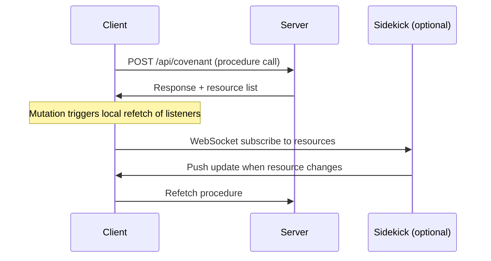

# Purpose

Covenant solves the most common friction in full-stack development: calling your backend from your frontend without losing type safety, duplicating types, or guessing at API shapes.

It accomplishes this with three core ideas:

- **Covenant files** — a shared contract imported by both frontend and backend. It only contains validation schemas, never implementation. This means an AI agent (or human) can work on either side knowing only the covenant.
- **Resources** — every procedure declares which data it touches. When a mutation runs, listeners automatically refetch. Cache invalidation becomes declarative.
- **Sidekick** — an optional WebSocket service that extends resource invalidation across clients and enables realtime bidirectional channels.

# Architecture

A Covenant app has three parts:



The **covenant file** sits at the center — both sides import it for types, but they never import each other:

```
      covenant.ts
     /            \
  server.ts     client.ts
  (backend)     (frontend)
```

This hard separation makes Covenant AI-friendly: an agent working on the frontend only needs to read `covenant.ts`, not the server implementation.

# Three Steps

Every Covenant app follows the same pattern:

1. **Declare** — `declareCovenant({ procedures, channels })` in a shared file
2. **Implement** — `CovenantServer` with `defineProcedure()` / `defineChannel()` on the server
3. **Call** — `CovenantClient` or `CovenantReactClient` on the frontend

See [Quickstart](/handbook/quickstart) for a complete working example.
